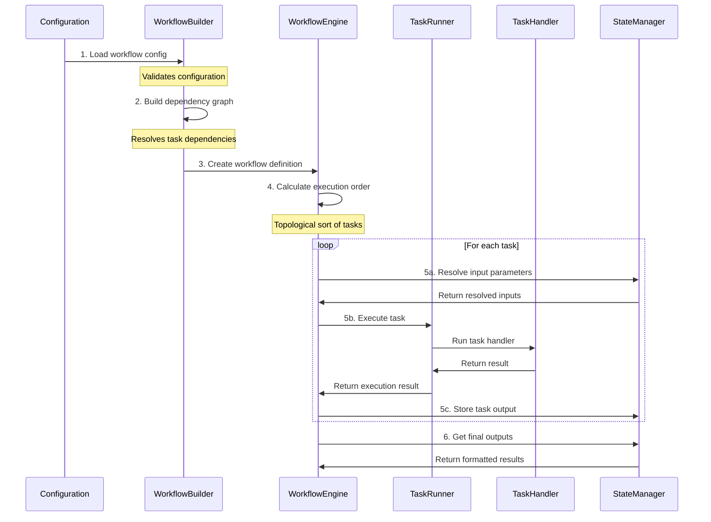

# Freshflow Architecture Guide

## System Architecture

### How It All Works

Freshflow is a workflow orchestration system that processes your workflows in several stages:



Let's break down each stage:

1. **Configuration Loading**
   ```json
   {
       "workflow_name": "example_flow",
       "modules": {
           "task1": {
               "identifier": "downloader",
               "user_config": {...}
           },
           "task2": {
               "identifier": "processor",
               "user_config": {
                   "input_data": {
                       "module_id": "task1",
                       "output_key": "content"
                   }
               }
           }
       }
   }
   ```

2. **Dependency Resolution**
   - WorkflowBuilder analyzes task dependencies
   - Creates a directed acyclic graph (DAG)
   - Validates no circular dependencies exist
   ```python
   dependencies = {
       'task2': ['task1'],  # task2 depends on task1
       'task1': []          # task1 has no dependencies
   }
   ```

3. **Workflow Definition**
   - Creates executable workflow structure
   - Maps configurations to task handlers
   - Sets up execution parameters
   ```python
   workflow_def = WorkflowDefinition(
       name="example_flow",
       tasks=[task1, task2],
       outputs={"final_output": "${task2.output}"}
   )
   ```

4. **Execution Order**
   - Determines optimal task execution sequence
   - Ensures dependencies are met before execution
   ```python
   execution_order = ['task1', 'task2']  # task1 must run first
   ```

5. **Task Execution**
   - For each task in order:
     a. Resolves input parameters using StateManager
     b. Executes task through TaskRunner
     c. Stores outputs for dependent tasks
   ```python
   # Example task execution
   inputs = state_manager.resolve_inputs(task.inputs)
   result = task_runner.execute_task(task, inputs)
   state_manager.store_output(task.name, result)
   ```

6. **Output Generation**
   - Collects and formats all task outputs
   - Applies output control rules
   - Returns final workflow results

### Key Components

1. **WorkflowBuilder**
   - Parses configuration
   - Validates task dependencies
   - Creates workflow definition
   ```python
   builder = WorkflowBuilder(config)
   workflow = builder.create_workflow_definition()
   ```

2. **WorkflowEngine**
   - Orchestrates task execution
   - Manages workflow state
   - Handles errors and retries
   ```python
   engine = WorkflowEngine()
   result = engine.execute(workflow)
   ```

3. **TaskRunner**
   - Executes individual tasks
   - Manages task lifecycle
   - Handles task-level errors
   ```python
   runner = TaskRunner()
   task_result = runner.execute_task(task, inputs)
   ```

4. **StateManager**
   - Stores task outputs
   - Resolves parameter references
   - Manages execution state
   ```python
   state = StateManager()
   state.store_output("task1", result)
   next_input = state.resolve_reference("${task1.output}")
   ```

## Core Concepts

### 1. Tasks and Components

At its heart, Freshflow is about running tasks in a specific order. There are two key concepts here:

- **Components**: These are the actual pieces of code that do the work (like downloading files, processing data, etc.)
- **Task Handlers**: These wrap components to make them work with Freshflow's workflow system

For example, if you have a component that downloads files from S3, you'd wrap it in a task handler like this:

```python
# First, create your component
class S3Downloader:
    def __init__(self, config):
        self.bucket = config.get('bucket')
        self.access_key = config.get('access_key')
    
    def download(self, file_path):
        # Download logic here
        return file_content

# Then wrap it in a task handler
@TaskHandlerRegistry.register('s3_downloader')
class DownloadTaskHandler(TaskHandler):
    def execute(self, task_input: Dict) -> Dict:
        config = task_input.get('user_config', {})
        downloader = S3Downloader(config)
        
        try:
            content = downloader.download(config['file_path'])
            return {
                'status': 'COMPLETED',
                'output': {'content': content}
            }
        except Exception as e:
            return {
                'status': 'FAILED',
                'output': {'error': str(e)}
            }
```

### 2. Understanding Dependencies

When building workflows, you need to understand three types of dependencies:

1. **Task Dependencies**
   - Tasks can depend on outputs from other tasks
   - Dependencies are defined in your workflow configuration:
   ```json
   {
       "process_task": {
           "identifier": "text_processor",
           "user_config": {
               "input_text": {
                   "module_id": "download_task",
                   "output_key": "content"
               }
           }
       }
   }
   ```

2. **Component Dependencies**
   - External libraries your component needs
   - Services it connects to
   - Resources it uses
   ```python
   class TextProcessor:
       def __init__(self, config):
           # Load required libraries
           try:
               import nltk
               nltk.download('punkt')
               self.nltk = nltk
           except ImportError:
               raise RuntimeError("NLTK is required")
           
           # Initialize services
           self.cache = redis.Redis(
               host=config.get('redis_host', 'localhost')
           )
   ```

3. **Resource Dependencies**
   - Database connections
   - File system access
   - Memory requirements
   ```python
   class ResourceManager:
       def __init__(self, config):
           self.min_memory = config.get('min_memory_mb', 512)
           self.temp_dir = config.get('temp_dir', '/tmp')
           
           # Verify resources
           self.check_available_memory()
           self.ensure_temp_dir_exists()
   ```

### 3. Controlling Output

One of the most important aspects is controlling what gets output at different levels:

#### A. Configuration Time Control

You can control output behavior when defining your workflow:

```json
{
    "workflow_name": "data_processor",
    "output_control": {
        "default_format": "summary",
        "max_output_size": 1000000,
        "log_level": "INFO",
        "task_specific": {
            "download_task": {
                "format": "minimal",
                "include_fields": ["file_name", "size"],
                "exclude_fields": ["raw_content"]
            }
        }
    },
    "modules": {
        "download_task": {
            "identifier": "s3_downloader",
            "user_config": {
                "bucket": "my-bucket",
                "output_format": "summary"
            }
        }
    }
}
```

#### B. Runtime Control

You can control output during task execution:

```python
class MyTaskHandler(TaskHandler):
    def execute(self, task_input):
        # Process data
        result = self.process_data()
        
        # Get output format from config or default
        output_format = task_input.get('output_format', 'full')
        
        # Format output accordingly
        if output_format == 'minimal':
            return {
                'status': 'COMPLETED',
                'output': {
                    'count': len(result)
                }
            }
        elif output_format == 'summary':
            return {
                'status': 'COMPLETED',
                'output': {
                    'count': len(result),
                    'stats': self.compute_stats(result)
                }
            }
        
        # Full output
        return {
            'status': 'COMPLETED',
            'output': result
        }
```

#### C. Logging Control

Control logging output at different levels:

```python
# In your component
class MyComponent:
    def __init__(self, config):
        self.logger = logging.getLogger(__name__)
        self.log_level = config.get('log_level', 'INFO')
        self.logger.setLevel(self.log_level)
        
    def process(self, data):
        # Debug level for detailed processing info
        self.logger.debug(f"Processing {len(data)} items")
        
        # Info level for important steps
        self.logger.info("Starting main processing")
        
        # Warning level for potential issues
        if len(data) > 1000:
            self.logger.warning("Large data set may impact performance")
```

### 4. Adding New Components

Here's a complete guide to adding a new component:

1. **Plan Your Component**
   - What does it do?
   - What inputs does it need?
   - What outputs will it produce?
   - What dependencies does it have?

2. **Create the Component Structure**
   ```bash
   components/
   └── text_processor/
       ├── __init__.py
       ├── processor.py
       └── utils.py
   ```

3. **Implement the Component**
   ```python
   # components/text_processor/processor.py
   class TextProcessor:
       def __init__(self, config):
           self.batch_size = config.get('batch_size', 1000)
           self.max_length = config.get('max_length', 10000)
           self.setup_logging(config)
           
       def setup_logging(self, config):
           self.logger = logging.getLogger(__name__)
           self.logger.setLevel(config.get('log_level', 'INFO'))
           
       def process(self, text):
           self.logger.info(f"Processing text of length {len(text)}")
           
           if len(text) > self.max_length:
               self.logger.warning("Text exceeds max length, will truncate")
               text = text[:self.max_length]
               
           # Process in batches for large texts
           results = []
           for i in range(0, len(text), self.batch_size):
               batch = text[i:i + self.batch_size]
               result = self.process_batch(batch)
               results.append(result)
               
           return self.combine_results(results)
           
       def process_batch(self, batch):
           # Your processing logic here
           pass
           
       def combine_results(self, results):
           # Combine batch results
           pass
```
4. **Create the Task Handler**

   ```python
   # workflow_configuration/tasks/handlers.py
   @TaskHandlerRegistry.register('text_processor')
   class TextProcessorHandler(TaskHandler):
       def execute(self, task_input: Dict) -> Dict:
           try:
               # Get configuration
               config = task_input.get('user_config', {})
               
               # Initialize component
               processor = TextProcessor(config)
               
               # Get input from previous task if specified
               text = config.get('input_text')
               if isinstance(text, dict) and 'module_id' in text:
                   # This is a reference to another task's output
                   text = self.get_input_from_task(text)
               
               # Process the text
               result = processor.process(text)
               
               # Format output based on configuration
               return self.format_output(result, config)
               
           except Exception as e:
               return {
                   'status': 'FAILED',
                   'output': {'error': str(e)}
               }
               
       def format_output(self, result, config):
           format_type = config.get('output_format', 'full')
           
           if format_type == 'minimal':
               return {
                   'status': 'COMPLETED',
                   'output': {
                       'processed': True,
                       'length': len(result)
                   }
               }
           elif format_type == 'summary':
               return {
                   'status': 'COMPLETED',
                   'output': {
                       'processed': True,
                       'length': len(result),
                       'stats': self.compute_stats(result)
                   }
               }
           
           return {
               'status': 'COMPLETED',
               'output': result
           }
```

5. **Use in Workflow**
   ```json
   {
       "workflow_name": "text_processing",
       "modules": {
           "process_text": {
               "identifier": "text_processor",
               "user_config": {
                   "batch_size": 500,
                   "max_length": 5000,
                   "log_level": "INFO",
                   "output_format": "summary",
                   "input_text": {
                       "module_id": "download_task",
                       "output_key": "content"
                   }
               }
           }
       }
   }
   ```

### 5. Best Practices

1. **Output Management**
   - Always provide different output formats (full, summary, minimal)
   - Use structured logging
   - Implement size limits
   - Clean up temporary data

2. **Error Handling**
   - Provide detailed error messages
   - Clean up resources on failure
   - Log errors with context
   - Implement retries for transient failures

3. **Resource Management**
   - Use context managers
   - Implement proper cleanup
   - Monitor resource usage
   - Handle resource exhaustion

4. **Testing**
   - Test all output formats
   - Test error conditions
   - Test resource cleanup
   - Test with different configurations

### 6. Components Documentation

#### Document Processing Components

1. **S3Downloader**
   - **Purpose**: Downloads files from S3 buckets
   - **Required Inputs**:
     ```json
     {
         "identifier": "s3_downloader",
         "user_config": {
             "s3_link": "s3://bucket-name/path/to/file",  // Required: S3 URI
             "access": "public"  // Required: "public" or "private"
         }
     }
     ```
   - **Optional Inputs**: None
   - **Outputs**:
     ```json
     {
         "status": "COMPLETED",
         "output": {
             "content": "<bytes>"  // Binary content of downloaded file
         }
     }
     ```
   - **Environment Variables**:
     - `AWS_ACCESS_KEY_ID` (if access="private")
     - `AWS_SECRET_ACCESS_KEY` (if access="private")

2. **DocumentChunker**
   - **Purpose**: Splits documents into manageable chunks
   - **Required Inputs**:
     ```json
     {
         "identifier": "document_processor",
         "user_config": {
             "chunk_size": 1000,  // Required: Integer
             "chunk_overlap": 200,  // Required: Integer
             "splitting_strategy": "recursive",  // Required: "recursive" or "simple"
             "input_content": {  // Required: Reference to content
                 "module_id": "s3_downloader",
                 "output_key": "content"
             }
         }
     }
     ```
   - **Optional Inputs**:
     - `min_chunk_size`: Integer (default: chunk_size/2)
   - **Outputs**:
     ```json
     {
         "status": "COMPLETED",
         "output": {
             "chunks": ["<chunk1>", "<chunk2>", ...]  // List of text chunks
         }
     }
     ```

3. **DocumentPreprocessor**
   - **Purpose**: Cleans and preprocesses text chunks
   - **Required Inputs**:
     ```json
     {
         "identifier": "document_preprocessor",
         "user_config": {
             "stop_words": [".", "\n"],  // Required: List of strings
             "input_chunks": {  // Required: Reference to chunks
                 "module_id": "document_processor",
                 "output_key": "chunks"
             }
         }
     }
     ```
   - **Optional Inputs**:
     - `remove_urls`: Boolean (default: false)
     - `remove_numbers`: Boolean (default: false)
     - `lowercase`: Boolean (default: true)
   - **Outputs**:
     ```json
     {
         "status": "COMPLETED",
         "output": {
             "processed_chunks": ["<processed1>", "<processed2>", ...]
         }
     }
     ```

4. **EmbeddingsGenerator**
   - **Purpose**: Generates vector embeddings from text
   - **Required Inputs**:
     ```json
     {
         "identifier": "embeddings_generator",
         "user_config": {
             "model": "all-minilm-l6-v2",  // Required: Model name
             "batch_size": 100,  // Required: Integer
             "dimensions": 1536,  // Required: Integer matching model
             "input_text": {  // Required: Reference to text
                 "module_id": "document_preprocessor",
                 "output_key": "processed_chunks"
             }
         }
     }
     ```
   - **Optional Inputs**:
     - `normalize_embeddings`: Boolean (default: true)
     - `use_gpu`: Boolean (default: false)
   - **Outputs**:
     ```json
     {
         "status": "COMPLETED",
         "output": {
             "embeddings": [[0.1, 0.2, ...], ...],  // List of embedding vectors
             "chunks": ["<chunk1>", "<chunk2>", ...]  // Original chunks
         }
     }
     ```

5. **VectorStore**
   - **Purpose**: Stores vectors in a vector database
   - **Required Inputs**:
     ```json
     {
         "identifier": "vector_store",
         "user_config": {
             "database": "pinecone",  // Required: Database type
             "index_name": "documents",  // Required: Index name
             "metric": "cosine",  // Required: "cosine", "euclidean", or "dot"
             "namespace": "pdf_docs",  // Required: Namespace
             "input_vectors": {  // Required: Reference to vectors
                 "module_id": "embeddings_generator",
                 "output_key": "embeddings"
             },
             "input_chunks": {  // Required: Reference to chunks
                 "module_id": "embeddings_generator",
                 "output_key": "chunks"
             }
         }
     }
     ```
   - **Optional Inputs**:
     - `batch_size`: Integer (default: 100)
     - `metadata_fields`: List[str] (default: [])
   - **Outputs**:
     ```json
     {
         "status": "COMPLETED",
         "output": {
             "message": "Vectors stored successfully"
         }
     }
     ```
   - **Environment Variables**:
     - `PINECONE_API_KEY` (required for Pinecone)

#### Retrieval Components

1. **TextInput**
   - **Purpose**: Handles user input for queries
   - **Required Inputs**:
     ```json
     {
         "identifier": "user_input",
         "user_config": {
             "prompt": "Enter your question: "  // Optional: Custom prompt
         }
     }
     ```
   - **Optional Inputs**:
     - `input_validation`: Regex pattern (default: none)
     - `max_length`: Integer (default: none)
   - **Outputs**:
     ```json
     {
         "status": "COMPLETED",
         "output": {
             "query": "<user_input>",
             "metadata": {
                 "timestamp": "<timestamp>",
                 "source": "user_input"
             }
         }
     }
     ```

2. **VectorRetriever**
   - **Purpose**: Retrieves relevant contexts from vector store
   - **Required Inputs**:
     ```json
     {
         "identifier": "vector_retriever",
         "user_config": {
             "model": "sentence-transformers/all-mpnet-base-v2",  // Required: Model name
             "index_name": "freshflow-docs",  // Required: Index name
             "namespace": "documentation",  // Required: Namespace
             "top_k": 3,  // Required: Number of results
             "input_query": {  // Required: Reference to query
                 "module_id": "user_input",
                 "output_key": "query"
             }
         }
     }
     ```
   - **Optional Inputs**:
     - `score_threshold`: Float (default: 0.0)
     - `filter`: Dict (default: none)
   - **Outputs**:
     ```json
     {
         "status": "COMPLETED",
         "output": {
             "contexts": [
                 {
                     "text": "<context_text>",
                     "score": 0.95,
                     "metadata": {...}
                 },
                 ...
             ]
         }
     }
     ```
   - **Environment Variables**:
     - `PINECONE_API_KEY` (required)

3. **OpenAIHandler**
   - **Purpose**: Generates responses using OpenAI models
   - **Required Inputs**:
     ```json
     {
         "identifier": "openai_handler",
         "user_config": {
             "model": "gpt-4-turbo-preview",  // Required: Model name
             "temperature": 0.7,  // Required: Float 0-1
             "max_tokens": 500,  // Required: Integer
             "system_prompt": "You are...",  // Required: System prompt
             "input_query": {  // Required: Reference to query
                 "module_id": "user_input",
                 "output_key": "query"
             },
             "input_contexts": {  // Required: Reference to contexts
                 "module_id": "vector_retriever",
                 "output_key": "contexts"
             }
         }
     }
     ```
   - **Optional Inputs**:
     - `top_p`: Float (default: 1.0)
     - `presence_penalty`: Float (default: 0.0)
     - `frequency_penalty`: Float (default: 0.0)
   - **Outputs**:
     ```json
     {
         "status": "COMPLETED",
         "output": {
             "response": "<generated_response>"
         }
     }
     ```
   - **Environment Variables**:
     - `OPENAI_API_KEY` (required)

#### Example Complete Workflows

1. **Document Ingestion Pipeline**:
```json
{
    "canvas_name": "ingestion_pipeline",
    "modules": {
        "s3_downloader": {
            "identifier": "s3_downloader",
            "user_config": {
                "s3_link": "s3://docs-bucket/document.pdf",
                "access": "public"
            }
        },
        "document_processor": {
            "identifier": "document_processor",
            "user_config": {
                "chunk_size": 1000,
                "chunk_overlap": 200,
                "splitting_strategy": "recursive",
                "input_content": {
                    "module_id": "s3_downloader",
                    "output_key": "content"
                }
            }
        },
        "embeddings_generator": {
            "identifier": "embeddings_generator",
            "user_config": {
                "model": "all-minilm-l6-v2",
                "batch_size": 100,
                "dimensions": 1536,
                "input_text": {
                    "module_id": "document_processor",
                    "output_key": "chunks"
                }
            }
        },
        "vector_store": {
            "identifier": "vector_store",
            "user_config": {
                "database": "pinecone",
                "index_name": "documents",
                "metric": "cosine",
                "namespace": "pdf_docs",
                "input_vectors": {
                    "module_id": "embeddings_generator",
                    "output_key": "embeddings"
                },
                "input_chunks": {
                    "module_id": "embeddings_generator",
                    "output_key": "chunks"
                }
            }
        }
    }
}
```

2. **Question Answering Pipeline**:
```json
{
    "canvas_name": "qa_pipeline",
    "modules": {
        "user_input": {
            "identifier": "user_input",
            "user_config": {
                "prompt": "Enter your question about the documentation: "
            }
        },
        "vector_retriever": {
            "identifier": "vector_retriever",
            "user_config": {
                "model": "sentence-transformers/all-mpnet-base-v2",
                "index_name": "documents",
                "namespace": "pdf_docs",
                "top_k": 3,
                "input_query": {
                    "module_id": "user_input",
                    "output_key": "query"
                }
            }
        },
        "openai_handler": {
            "identifier": "openai_handler",
            "user_config": {
                "model": "gpt-4-turbo-preview",
                "temperature": 0.7,
                "max_tokens": 500,
                "system_prompt": "You are a helpful assistant...",
                "input_query": {
                    "module_id": "user_input",
                    "output_key": "query"
                },
                "input_contexts": {
                    "module_id": "vector_retriever",
                    "output_key": "contexts"
                }
            }
        }
    }
}
```
